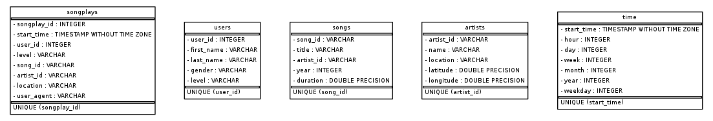
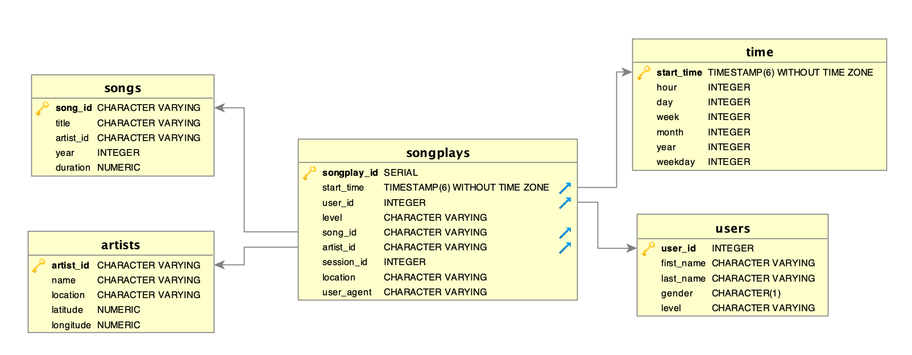

# Project description

A startup called Sparkify wants to analyze the data they've been collecting on songs and user activity on their new music streaming app. The analytics team is particularly interested in understanding what songs users are listening to. Currently, they don't have an easy way to query their data, which resides in a directory of JSON logs on user activity on the app, as well as a directory with JSON metadata on the songs in their app.

A database schema and ETL pipeline were designed and implemented aiming at providing the analytics team ease of delving into research, querying and joining data coming from different sources. 

# Database design

This star schema is composed by a **songplays** (records in log data associated with song plays)  fact table and **users** (users in the app), **songs** (songs in music database), **artists** (artists in music database), and **time** (timestamps of records in songplays broken down into specific units) dimension tables. This schema puts the playing of a song as our basic *unit of value*, which leads to an interesting perspective. Querying the most played songs allows for questions such as:

    - What is the average time duration of the most played songs?
    - What is the most played artist by geographical location? And if we consider user's genders?
    
The desgined schema can be visualized with the help of the following images:
    

    
# ETL Process

This project was fed with two main data sources: songs and log data. 

The first dataset is a subset of real data from the Million Song Dataset. Each file is in JSON format and contains metadata about a song and the artist of that song. 

The second dataset consists of log files in JSON format generated by this event simulator based on the songs in the dataset above. These simulate activity logs from a music streaming app based on specified configurations.

Those serialized data were conveniently parsed, through ETL python scripts, into row-like values that fed each individual table. Timestamps were digested and aggregated with different songplay data allowing for greater granularity when querying into user behavior.

# Project Repository Files

- data/
- sql_queries.py
- create_tables.py
- etl.py
- imager.py

# How to run the project

This project can be locally run if a running instance of **PostgreSQL** is to be found on your system along with the python library **psycopg2**, which provides a popular PostgreSQL database adapter for the Python programming language. 